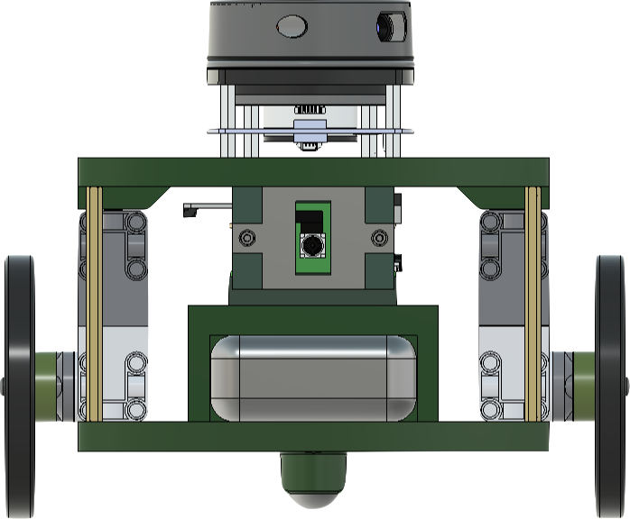
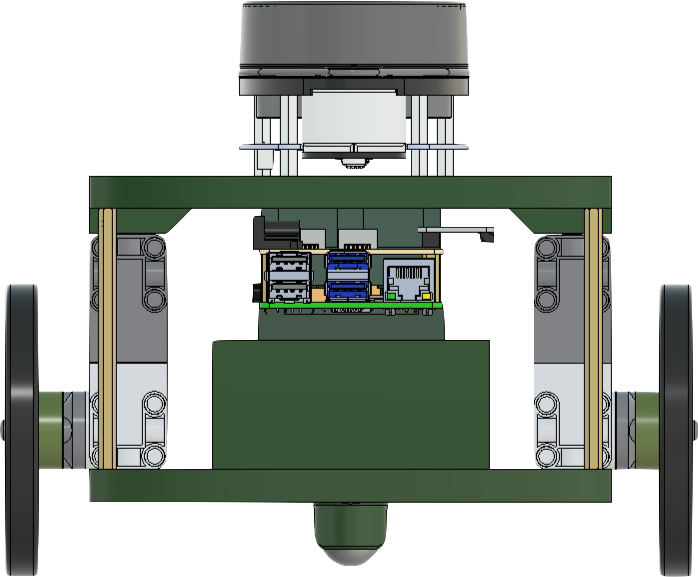
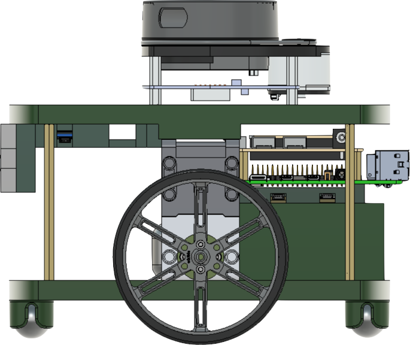
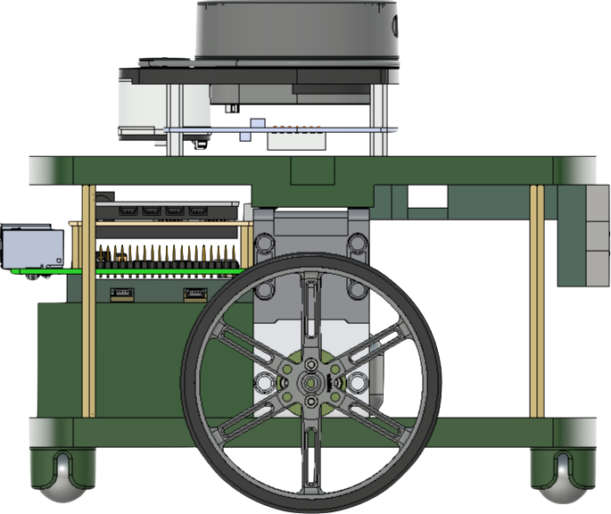
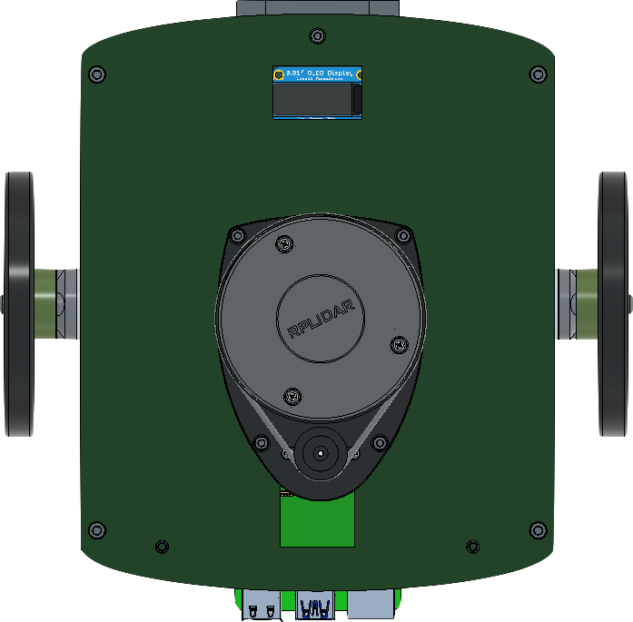
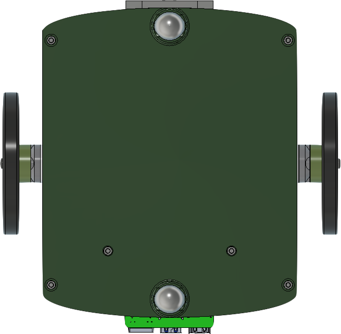
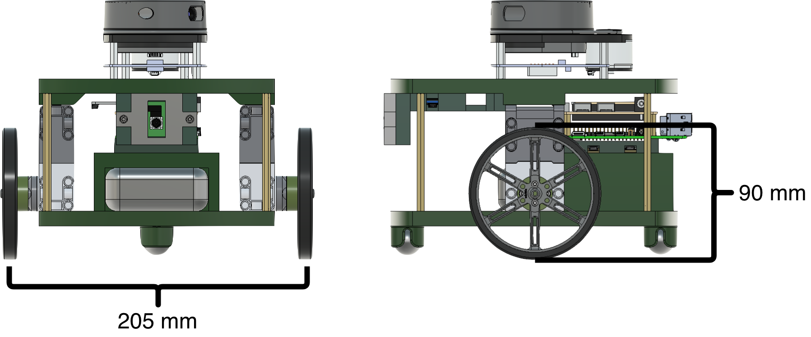

# realm_tools

This package contains the core Python libraries for REALM. It is structured into three sub-libraries: `robot_lib`, `simulation_lib`, and `image_lib`.

---

## HamBot

The `HamBot` class is the base robot class for the REALM framework. It interfaces directly with the Webots Supervisor API and provides ready-to-use access to all onboard sensors, motors, and simulation control functions.

The physical HamBot is an open-source differential drive robot. Its Webots model mirrors the real hardware specs.

---

### Robot Views

<table>
  <tr>
    <td align="center"><b>Front</b></td>
    <td align="center"><b>Rear</b></td>
    <td align="center"><b>Left</b></td>
  </tr>
  <tr>
    <td></td>
    <td></td>
    <td></td>
  </tr>
  <tr>
    <td align="center"><b>Right</b></td>
    <td align="center"><b>Top</b></td>
    <td align="center"><b>Bottom</b></td>
  </tr>
  <tr>
    <td></td>
    <td></td>
    <td></td>
  </tr>
</table>

---

### Specifications



| Characteristic                   | Value         |
|----------------------------------|---------------|
| Length                           | 200 mm        |
| Width                            | 184 mm        |
| Wheel Diameter / Radius          | 90 mm / 45 mm |
| Axel Width                       | 205 mm        |
| Height                           | 220 mm        |
| Weight                           | 1.65 kg       |
| Max forward/reverse wheel speed  | 0.81 m/s      |
| Max forward/reverse motor speed  | 18 rad/s      |

### Hardware

| Component | Details |
|-----------|---------|
| Motors | [LEGO Technic Large Motors](https://le-www-live-s.legocdn.com/sc/media/files/support/spike-prime/techspecs_techniclargeangularmotor-1b79e2f4fbb292aaf40c97fec0c31fff.pdf) via [LEGO Build HAT](https://www.raspberrypi.com/products/build-hat/) |
| IMU | [Adafruit BNO055](https://learn.adafruit.com/adafruit-bno055-absolute-orientation-sensor/python-circuitpython) |
| LiDAR | [Slamtec RPLidar A2](https://learn.adafruit.com/slamtec-rplidar-on-pi) |
| Camera | Front-facing, 224×224, with object recognition |
| GPS | Absolute position in world frame |

---

## Class Structure

REALM uses a three-tier inheritance pattern:

```
HamBot          ← base class, committed to repo (do not modify)
  └── MyRobot   ← user template, committed to repo (extend this)
        └── YourRobot  ← personal implementation, gitignored
```

```python
# realm_tools/robot_lib/hambot.py
class HamBot(Supervisor): ...

# realm_tools/robot_lib/my_robot.py
from realm_tools.robot_lib.hambot import HamBot
class MyRobot(HamBot): ...
```

---

## HamBot Attributes

| Attribute | Description |
|-----------|-------------|
| `experiment_supervisor` | Webots Supervisor interface |
| `robot_display` | Webots Display device |
| `left_motor`, `right_motor` | Rotational motors |
| `all_motors` | List of both motors |
| `left_encoder`, `right_encoder` | Wheel position sensors |
| `all_encoders` | List of both encoders |
| `camera` | Camera with recognition enabled |
| `lidar` | RPLidar A2 with point cloud enabled |
| `imu` | IMU (roll/pitch/yaw) |
| `gps` | GPS sensor |
| `wheel_radius` | 0.045 m |
| `axel_length` | 0.205 m |
| `max_motor_velocity` | Max velocity from motor specs |
| `timestep` | Simulation timestep in ms |

---

## HamBot Methods

### Sensors

| Method | Returns | Description |
|--------|---------|-------------|
| `sensor_calibration(stop_num=1)` | — | Steps the simulation to flush sensor values |
| `get_robot_pose()` | `(x, y, theta)` | Current position and heading |
| `get_compass_reading()` | `float` | Heading in degrees (0–360, East=0) |
| `get_encoder_readings()` | `[left, right]` | Wheel encoder values in radians |
| `get_left_motor_encoder_reading()` | `float` | Left encoder value |
| `get_right_motor_encoder_reading()` | `float` | Right encoder value |
| `get_lidar_range_image()` | `list` | 360° LiDAR range scan in meters |
| `get_min_lidar_reading()` | `float` | Minimum LiDAR distance |

### Motion

| Method | Description |
|--------|-------------|
| `sat(velocity)` | Clamps velocity to motor limits |
| `set_left_motor_velocity(v)` | Set left motor speed (clamped) |
| `set_right_motor_velocity(v)` | Set right motor speed (clamped) |
| `go_forward(velocity=1)` | Set both motors to the same speed |
| `stop()` | Set all motors to 0 |
| `slow_stop()` | Gradually ramp motors to 0 |
| `rotate(degrees, Kp, Ki, Kd, margin_error)` | Rotate in place using PID on IMU heading |
| `move_forward(distance, Kp, margin_error)` | Move forward using proportional control on encoders |
| `calculate_wheel_distance_traveled(start)` | Distance traveled in meters from encoder start reading |

### Simulation / Supervisor

| Method | Description |
|--------|-------------|
| `teleport_robot(x, y, z, theta)` | Instantly move the robot to a pose |
| `load_environment(maze_file)` | Load an XML maze (walls, obstacles, landmarks) |
| `reset_environment()` | Remove all loaded maze nodes and reset |
| `move_to_start(mode='training', index=0)` | Move robot to a start position. `mode`: `'training'` or `'testing'`. `index`: position index, or `-1` for random. Falls back to random on invalid input. |
| `check_at_goal()` | Returns `True` if robot is within range of the goal |
| `get_dist_to_goal()` | Distance to goal in meters |
| `update_robot_display(name='default')` | Load and scale an image from `data/DataCache/` to fill the robot display |

---

## Gymnasium Environment

`simulation_lib/webots_torch_environment.py` provides a `WebotsEnv` skeleton that follows the [Gymnasium API](https://gymnasium.farama.org/api/env/) and is compatible with [Stable-Baselines3](https://stable-baselines3.readthedocs.io/).

```python
from realm_tools.simulation_lib.webots_torch_environment import WebotsEnv

env = WebotsEnv(max_steps_per_episode=200)
obs, info = env.reset()
obs, reward, terminated, truncated, info = env.step(action)
```

Fill in `reset()`, `step()`, and the `action_space` / `observation_space` definitions for your experiment.

---

## Usage Example

The distance traveled by each wheel is calculated from the change in encoder reading (radians) multiplied by the wheel radius (meters). The robot's forward displacement is the average of the two wheels:

```
left_distance  = Δleft_encoder  × wheel_radius
right_distance = Δright_encoder × wheel_radius
distance       = (left_distance + right_distance) / 2
```

```python
import os
os.chdir("../../..")

from realm_tools.robot_lib.my_robot import MyRobot

# Create the robot instance
robot = MyRobot()

# Load the environment from a maze file
robot.load_environment('simulation/worlds/mazes/Samples/WM00.xml')

# Move robot to training start position 0
robot.move_to_start(mode='training', index=0)

# Record starting encoder values (radians)
left_encoder_start  = robot.get_left_motor_encoder_reading()
right_encoder_start = robot.get_right_motor_encoder_reading()

# Main control loop
while robot.experiment_supervisor.step(robot.timestep) != -1:

    # Read current encoder values (radians)
    left_encoder  = robot.get_left_motor_encoder_reading()
    right_encoder = robot.get_right_motor_encoder_reading()

    # Calculate distance each wheel has traveled since start (meters)
    left_distance  = (left_encoder  - left_encoder_start)  * robot.wheel_radius
    right_distance = (right_encoder - right_encoder_start) * robot.wheel_radius

    # Forward displacement = average of both wheels
    distance_traveled = (left_distance + right_distance) / 2

    # Print sensor readings
    print("Left wheel distance: ",  round(left_distance,  3), "m")
    print("Right wheel distance:", round(right_distance, 3), "m")
    print("Distance traveled:",    round(distance_traveled, 3), "m")
    print("Lidar front:",          robot.get_lidar_range_image()[180], "m")

    # Drive forward
    robot.set_left_motor_velocity(5)
    robot.set_right_motor_velocity(5)

    # Stop after 1.5 meters
    if distance_traveled >= 1.5:
        robot.set_left_motor_velocity(0)
        robot.set_right_motor_velocity(0)
        break
```

---

## image_lib

Utilities for image feature extraction from the robot's camera, used for visual place cell generation and landmark detection.

| Module | Description |
|--------|-------------|
| `feature_extractor.py` | CNN-based feature extraction wrapper |
| `image_feature_lib.py` | Multimodal image feature processing |
