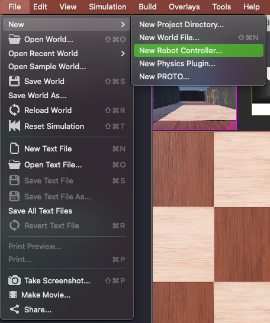
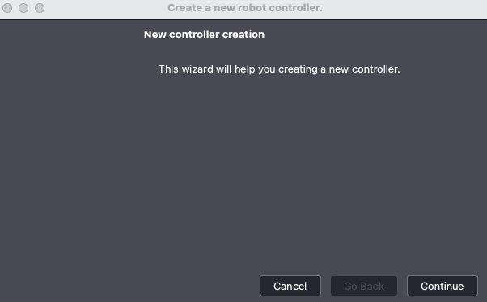
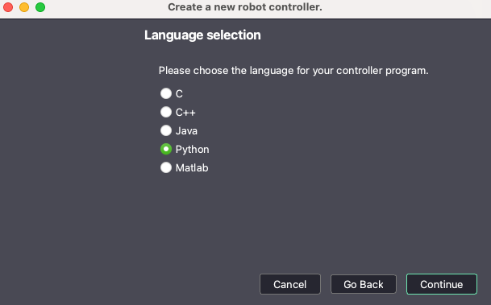
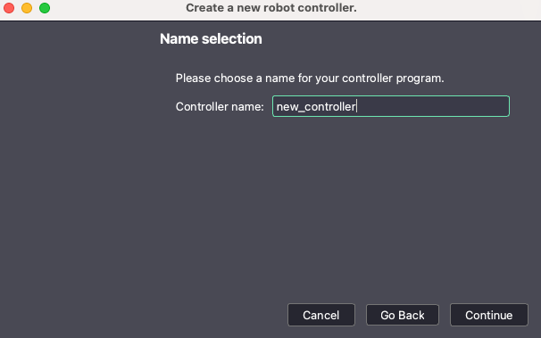
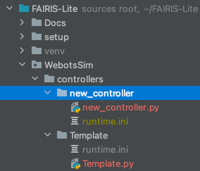
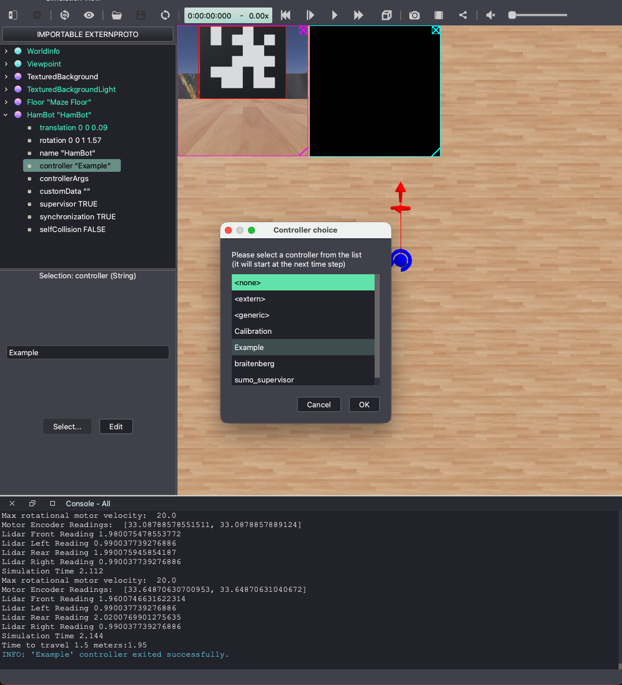

# Webots Robot Controllers

REALM uses Python scripts to control the simulated robot inside Webots. You can find more details in the [Webots Controller Programming Documentation](https://cyberbotics.com/doc/guide/controller-programming?tab-language=python).

REALM provides a base class and libraries that streamline controller development, but you will still need to create a new controller for each experiment. Follow the steps below.

### Requirements
This guide assumes you have already completed the [REALM setup](../../README.md).

---

## How to Create a New Webots Robot Controller

**1.** Launch Webots and open the world file located at `REALM/simulation/worlds/empty_room.wbt`

**2.** Within the Webots GUI select: `File → New → New Robot Controller...`



**3.** This will launch the controller creation wizard — select `Continue`



**4.** Select `Python` as the language



**5.** Provide a name for the new controller



**6.** Confirm the creation of the new directory and Python file. You may be asked to grant Webots access to the directory.

**7.** Copy the `runtime.ini` file from `REALM/simulation/controllers/Example/` into the newly created controller directory. This tells Webots to use the `realm_core_venv` Python interpreter.



**8.** Start your controller with the following template. It imports `MyRobot`, loads an environment, moves to a starting position, then drives forward 1.5 meters using encoder-based kinematics before stopping.

The distance traveled by each wheel is calculated from the change in encoder reading (radians) multiplied by the wheel radius (meters). The robot's forward displacement is the average of the two wheels:

```
left_distance  = Δleft_encoder  × wheel_radius
right_distance = Δright_encoder × wheel_radius
distance       = (left_distance + right_distance) / 2
```

```python
import os
os.chdir("../../..")

from realm_tools.robot_lib.my_robot import MyRobot

# Create the robot instance
robot = MyRobot()

# Load the environment from a maze file
robot.load_environment('simulation/worlds/mazes/Samples/WM00.xml')

# Move robot to training start position 0
robot.move_to_start(mode='training', index=0)

# Record starting encoder values (radians)
left_encoder_start  = robot.get_left_motor_encoder_reading()
right_encoder_start = robot.get_right_motor_encoder_reading()

# Main control loop
while robot.experiment_supervisor.step(robot.timestep) != -1:

    # Read current encoder values (radians)
    left_encoder  = robot.get_left_motor_encoder_reading()
    right_encoder = robot.get_right_motor_encoder_reading()

    # Calculate distance each wheel has traveled since start (meters)
    left_distance  = (left_encoder  - left_encoder_start)  * robot.wheel_radius
    right_distance = (right_encoder - right_encoder_start) * robot.wheel_radius

    # Forward displacement = average of both wheels
    distance_traveled = (left_distance + right_distance) / 2

    # Print sensor readings
    print("Left wheel distance: ",  round(left_distance,  3), "m")
    print("Right wheel distance:", round(right_distance, 3), "m")
    print("Distance traveled:",    round(distance_traveled, 3), "m")
    print("Lidar front:",          robot.get_lidar_range_image()[180], "m")

    # Drive forward
    robot.set_left_motor_velocity(5)
    robot.set_right_motor_velocity(5)

    # Stop after 1.5 meters
    if distance_traveled >= 1.5:
        robot.set_left_motor_velocity(0)
        robot.set_right_motor_velocity(0)
        break
```

---

## How to Assign a Controller to the Robot

**1.** Launch Webots and open the world file at `REALM/simulation/worlds/empty_room.wbt`

**2.** In the left scene panel, expand the `HamBot` node

**3.** Select the `controller` field under `HamBot`

**4.** At the bottom of the left panel, click `Select...`

**5.** A window will list all available controllers — select yours and click `OK`


